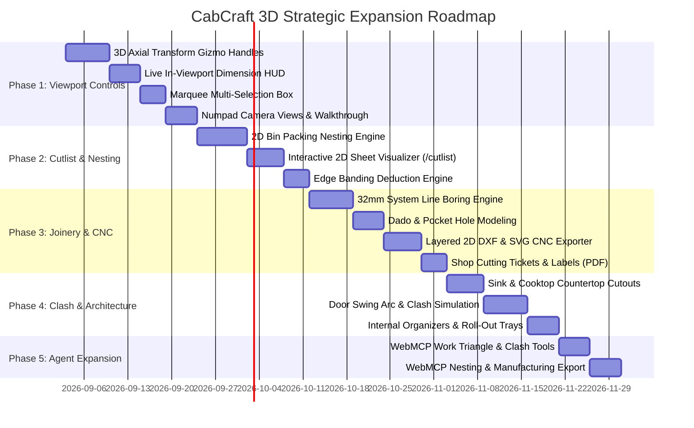

# CabCraft 3D: Controls, Ergonomics & Feature Set Expansion Plan

## Executive Summary & 2026 Strategic Vision

CabCraft 3D is uniquely positioned as an agent-native, browser-based cabinet making studio. While legacy production suites (**Mozaik**, **Cabinet Vision**) require heavy desktop Windows installations and expensive subscriptions, and design-first platforms (**SketchUp**) require sprawling third-party plugins (CabinetSense, OpenCutList) with zero agent integration, CabCraft 3D operates entirely client-side with full WebMCP programmatic agency.

This expansion plan outlines the strategic roadmap to advance CabCraft 3D from a **layout and assembly visualizer** into a **full design-to-manufacturing studio** (Screen-to-Machine / CAD-to-Cutlist). It addresses tactile viewport ergonomics, precision 3D manipulation, 2D sheet nesting optimization, machine-ready digital fabrication (CNC DXF/SVG), custom joinery, and architectural clash detection.

---

## Benchmark Matrix: CabCraft 3D vs. Industry Standards

| Feature Dimension | Legacy Production (Mozaik / Cabinet Vision) | Design-First (SketchUp + Plugins) | Consumer (IKEA Kreativ / Planner 5D) | **CabCraft 3D (Target State)** |
| :--- | :--- | :--- | :--- | :--- |
| **Runtime Environment** | Heavy Windows desktop install | Desktop CAD + Ruby runtime | WebGL (Cloud-tethered) | **Local-First WebGL / Next.js static** |
| **Agent / AI Integration** | Closed proprietary API | Unofficial scripting | None | **Native WebMCP (22+ tools, W3C draft)** |
| **3D Navigation & Controls** | Cluttered ribbons, modal CAD | Orbit/Pan/Zoom + tools | Simple touch / orbit | **Dock + In-Canvas Gizmo + Hotkeys** |
| **Viewport Manipulators** | Numeric dialogs & 2D plans | Move/Rotate/Scale tools | Drag & drop only | **Interactive 3D Axial Transform Gizmo** |
| **Precision Snapping** | Manual coordinate entry | Inference engine | Surface grid only | **Magnetic Multi-Obstacle Inferred Snap** |
| **Cut List & 2D Nesting** | Built-in True-Shape Nesting | Via OpenCutList extension | None | **Browser-Native Guillotine / 2D Nesting** |
| **Edge Banding Deduction** | Comprehensive | Manual / Plugin | None | **Per-edge thickness deduction & roll BOM** |
| **Joinery & 32mm Boring** | Fully parametric CNC boring | Parametric plugins | None | **32mm System line boring + Dado/Pocket** |
| **Machine Output** | G-Code / Post-processors | DXF via plugins | None | **Layered 2D DXF & SVG for CNC Routers** |
| **Assembly Guidance** | 2D exploded drawing prints | Manual 3D scenes | Wordless 2D PDFs | **Interactive 3D Stage + Vector CAD PDF** |

---

## Pillar I: Viewport Ergonomics & 3D Precision Controls

### 1.1. Interactive 3D Transform Gizmo (Manipulator Handles)
- **Problem**: Currently, moving cabinets in the 3D scene requires dragging the cabinet mesh itself along the wall. There is no direct, tactile control over vertical elevation adjustment or depth offset in the 3D viewport without switching to the numeric inspector panel.
- **Solution**:
  - Implement a contextual 3D transform manipulator anchored at the selected cabinet’s origin when in **Select** mode:
    - **Red Axis Arrow (X)**: Slides cabinet along the wall plane (Wall Offset).
    - **Green Axis Arrow (Y)**: Adjusts cabinet elevation above the finished floor (Elevation).
    - **Blue Axis Arrow (Z)**: Adjusts depth offset into the room (for furred-out walls or floating projections).
    - **Planar Handle (XY)**: Allows free 2D wall-plane movement.
  - **Visual Feedback**: Hovering over an axis handle highlights it with an active pulse; dragging constrains pointer movement strictly along that vector.
  - **Elevation Snap Locks**: Smart snaps at standard architectural heights:
    - `0"` (Finished Floor / Base cabinet datum)
    - `34 1/2"` (Standard base cabinet carcass height)
    - `36"` (Standard finished countertop height)
    - `54"` (Standard bottom of wall cabinets: 18" above countertop)
    - `84"` / `90"` / `96"` (Standard tall cabinet and wall cabinet top alignments)

### 1.2. Direct In-Viewport Dimension Editing (Live Dimensional HUD)
- **Problem**: Users see 3D dimension badges (`30" W`, `34 1/2" H`) and wall lengths, but adjusting them requires hunting through the side inspector fields.
- **Solution**:
  - **Dynamic Clearance Strings**: While an entity is selected or dragged, render live dimension leader lines showing:
    - Distance to left wall corner / adjacent cabinet.
    - Distance to right wall corner / adjacent cabinet.
    - Clearance to ceiling.
  - **Click-to-Edit HUD**: Clicking any in-viewport dimension badge opens an inline micro-input directly over the 3D canvas. Typing a new value (e.g., `36` or `36.5` or `36 1/2`) and pressing Enter immediately updates the dimension or position.

### 1.3. Marquee (Box) Multi-Selection
- **Problem**: Selecting multiple cabinets currently requires holding `Ctrl`/`Cmd` and clicking each item individually. Selecting an entire run of 8 base cabinets is tedious.
- **Solution**:
  - In **Select** mode, clicking and dragging on the canvas background draws an illuminated marquee selection box (`border: 1px solid #38BDF8`, translucent blue fill).
  - Any cabinet whose bounding box intersects the 2D projected screen rectangle is selected.
  - **Keyboard Modifiers**:
    - `Shift` + Marquee: Adds intersecting items to the existing selection.
    - `Alt` + Marquee: Inverts / subtracts intersecting items from the selection.

### 1.4. Numpad Camera Standard & First-Person Walkthrough Mode
- **Problem**: Navigating between top blueprint view, front elevations, and perspective requires clicking top bar buttons. Furthermore, evaluating whether a kitchen island allows comfortable passage requires experiencing the room at human eye height.
- **Solution**:
  - **Numpad Camera Controls (Blender / CAD Standard)**:
    - `Numpad 1`: Front Elevation (Active Wall View)
    - `Numpad 3`: Side Profile View
    - `Numpad 7`: Top Blueprint Plan View
    - `Numpad 9`: Reverse / Opposite View
    - `Numpad 5`: Toggle Perspective / Orthographic projection
    - `Numpad .`: Focus on Selection (`F`)
  - **First-Person Walkthrough Mode**:
    - Toggleable **Walk** mode in the floating tool dock.
    - Locks camera height at `66"` (average human standing eye level).
    - `WASD` or Arrow keys navigate forward, left, backward, right inside the kitchen; mouse look controls panning.
    - Collision boundary prevents walking through walls.
    - Allows direct visual evaluation of walkway widths (NKBA standard 36" minimum for single cook, 42" for multi-cook).

### 1.5. Haptic Audio Feedback & Canvas Toolbar Quick-Actions
- **Solution**:
  - **Subtle Audio Snapping Ticks**: Add synthesized web-audio clicks (ultra-short 8ms 800Hz sine burst with exponential decay, volume < 0.1, fully toggleable in settings) when an entity snaps to an alignment guide or wall corner.
  - **In-Canvas Screenshot Capture Button**: Add a camera icon button to the floating dock that triggers high-resolution canvas capture with optional transparent background or blueprint dark-mode frame.

---

## Pillar II: Advanced Cabinet Making, Joinery & Manufacturing Features

### 2.1. 2D Cut List & Sheet Nesting Optimizer (Screen-to-Machine)
- **Problem**: CabCraft 3D calculates BOM sheet counts using rough surface area divided by sheet area plus 10% waste. Real cabinet shops require an exact cut list showing how individual cabinet panels are cut from standard 4x8 plywood sheets with minimal scrap.
- **Solution**:
  - **Browser-Native 2D Bin Packing Engine**:
    - Implement a 2D guillotine cut / maximal rectangles bin-packing algorithm in TypeScript.
    - Input: All resolved carcass parts (side panels, decks, stretchers, shelves, back panels) from the project's built cabinets.
    - Standard Sheet Sizes: 48" × 96" (4x8), 48" × 120" (4x10), 60" × 60" (Baltic Birch 5x5).
    - Configurable Parameters:
      - **Saw Kerf**: Default 1/8" (0.125").
      - **Sheet Trim Margin**: Default 1/2" (0.5") perimeter cleanup cut.
      - **Grain Direction**: Option to lock grain lengthwise for exterior panels, or allow 90° rotation for interior stretchers/shelves.
  - **Interactive 2D Sheet Layout Visualizer**:
    - Render interactive SVG cutting diagrams in a new `/cutlist` route.
    - Color-coded parts with labeled cabinet IDs (e.g., `B30 - Left Side Panel - 34.5" × 24"`).
    - Display sheet yield percentage (e.g., `89.4% material yield, 3 sheets required`).
    - Diagram displays primary rip cuts and cross cuts for table-saw and panel-saw operators.

### 2.2. Edge Banding Specification & Automatic Dimensional Deduction
- **Problem**: When applying 1mm or 2mm edge banding to plywood panels, the raw cut dimensions must be smaller than the finished dimensions. Forgetting to deduct edge banding thickness results in oversize doors and drawer reveals that bind.
- **Solution**:
  - **Edge Banding Configuration**:
    - Options: None, 0.5mm standard iron-on tape, 1mm PVC, 2mm heavy-duty impact edge, 3mm solid wood edge.
    - Specify per part: Front edge only, Top/Bottom/Sides.
  - **Automatic Raw Dimension Deduction**:
    - Raw Cut Width = Finished Width - (Left Banding Thickness + Right Banding Thickness).
    - Raw Cut Height = Finished Height - (Top Banding Thickness + Bottom Banding Thickness).
  - **BOM Integration**:
    - Calculates total linear feet / meters of edge banding tape required and adds procurement rolls to the BOM.

### 2.3. Joinery Selection & 32mm Line Boring Engine
- **Problem**: Cabinet makers use different joinery methods depending on their shop equipment (Pocket Hole, Dado/Rabbet, Dowels, or Confirmat screws).
- **Solution**:
  - **Joinery Method Selection** (Configurable globally or per cabinet):
    1. **Pocket Hole Joinery**: Generates pocket screw hole positions on stretchers and decks; specifies pocket screw counts in the BOM.
    2. **Dado & Rabbet**: Generates 1/4" deep dados in side panels for decks and fixed shelves, with 1/4" rear capture rabbet.
    3. **32mm System Line Boring (Euro Standard)**:
       - Generates standard 5mm shelf pin holes spaced 32mm on center.
       - Standard 37mm setback from front and rear carcass edges.
       - Provides hinge mounting plate holes at standard 32mm intervals.
    4. **Confirmat Screws / Wooden Dowels**: Drill-and-insert fastener locations for RTA flat-pack production.
  - **Visual 3D & CAD Representation**:
    - Renders drill hole patterns and dados directly in the assembly step diagrams and CAD projections.

### 2.4. Digital Fabrication: Layered CNC DXF & SVG Export
- **Problem**: Shops with CNC routers (Shapeoko, Avid CNC, ShopBot, industrial flat-table CNCs) need DXF or SVG files to import into CAM software (Vectric VCarve, Fusion 360 CAM, LightBurn).
- **Solution**:
  - Export machine-ready 2D DXF and SVG files with standardized CAD layer mapping:
    - **Layer `OUTLINE_CUT`**: Full-depth through cut (toolpath: outside profile).
    - **Layer `DADO_POCKET`**: 1/4" pocket milling for cabinet bottom decks and back rabbets.
    - **Layer `DRILL_5MM`**: 5mm drilling operations for shelf pins and euro hinge plates.
    - **Layer `DRILL_POCKET`**: Pocket screw pilot holes.
    - **Layer `PART_LABELS`**: Text annotations for part verification.
  - **Printable Cutting Tickets (Shop Labels)**:
    - Generate printable Avery-style part labels (PDF) containing: Cabinet Code, Part Name, Finished Dimensions, Edge Banding Indicators, and Part ID.

---

## Pillar III: Architectural & Interior Fit-Out Expansion

### 3.1. Custom Countertop Sink & Cooktop Cutout Engine
- **Problem**: Placed countertops are solid rectangular blocks; in real kitchen planning, the sink base cabinet requires a sink cutout, and the cooktop requires a ventilation and drop-in cutout.
- **Solution**:
  - **Sink & Cooktop Cutout Generator**:
    - Automatically detects sink base (`SB36`) and cooktop base locations.
    - Places parametric cutouts on the countertop deck with customizable corner radii.
    - Cutout presets: Undermount single-basin (e.g. 30" × 18"), 50/50 double-basin, 60/40 basin, and 30"/36" drop-in cooktops.
    - Faucet hole drilling options: Single-hole, 3-hole 4" centerset, 8" widespread.
    - **Clearance Rule Verification**: Alerts if cutout leaves less than 1.5" front or rear countertop bridge material (structural cracking risk).
  - **Countertop Edge Profiles & Waterfalls**:
    - Edge profiles: Eased (Square), Half Bullnose, Full Bullnose, Ogee, 45° Bevel.
    - Mitered Waterfall Edge option: Extends countertop surface down to the floor at run ends.

### 3.2. Dynamic Clearance Clash & Door Swing Arc Simulation
- **Problem**: Designing a kitchen layout can lead to costly mistakes where an open dishwasher blocks adjacent drawers, or refrigerator doors hit opposing island cabinets.
- **Solution**:
  - **Interactive 3D Opening Simulation**:
    - In the planner or inspection panel, click **Open Fronts** to animate cabinet doors swinging open to their configured hinge angles (110° or 165°) and drawers sliding out.
    - Animate appliance door drops: Dishwasher door opens 90° flat; oven door opens 90°; refrigerator doors open 135°.
  - **Automatic Collision & Clash Detection**:
    - Real-time 3D intersection checks flag physical collisions:
      - Open dishwasher colliding with open trash pull-out or sink base door.
      - Pull-out drawers blocked by projecting door casings or 90° corner door handles.
      - Corner lazy Susan door colliding with adjacent drawer handles.
    - Highlights clashing volumes in pulsing translucent red with NKBA mitigation guidance.

### 3.3. Internal Cabinet Organizers & Roll-Out Trays
- **Solution**:
  - Extend cabinet configuration to include popular internal organizers:
    - **Roll-Out Trays**: 1 or 2 full-extension pull-out drawer boxes behind base cabinet doors.
    - **Double Waste Pull-Out**: Dual 35qt or 50qt trash/recycling bin insert inside `B18` or `B21`.
    - **Spice Pull-Out Rack**: Slim vertical slide-out organizer for `B09` / `B12`.
    - **Vertical Tray Dividers**: Vertical slots in wall bridge cabinets (`W3015`) for baking sheets and cutting boards.
  - Automatically adds organizers and required slides to the BOM.

### 3.4. Architectural Lighting & Electrical Planning
- **Solution**:
  - **Under-Cabinet LED Channel Recesses**:
    - Routes 1/2" wide, 1/4" deep continuous channel on wall cabinet bottom decks for flush LED tape extrusions.
  - **Puck Lights**:
    - Parametric round puck light cutouts centered under wall cabinets.
  - **Electrical Outlets & Switches**:
    - Place standard single-gang / double-gang outlet cutouts on backsplashes and island end panels.
    - Checks NKBA guidelines: no point along the countertop should be more than 24" from an electrical receptacle.

---

## Pillar IV: Agentic & WebMCP Ecosystem Enhancements

### 4.1. Live Clearance Clash Event Stream
- **Problem**: An AI agent currently has to call `validate_project` after mutating the scene. If it moves a cabinet, it doesn't receive real-time spatial collision feedback during the operation.
- **Solution**:
  - Add WebMCP tool `get_clearance_clashes`:
    - Returns exact 3D bounding collision pairs (e.g. `cabinet B30 collided with opening Door-1 by 2.25 inches`).
    - Returns computed minimum delta vector to resolve the clash.

### 4.2. Kitchen Ergonomics & NKBA Work Triangle Optimization
- **Solution**:
  - Add WebMCP tool `evaluate_work_triangle`:
    - Measures direct travel distance between Sink Center, Refrigerator Center, and Cooktop Center.
    - NKBA Standards:
      - Sum of triangle legs must be between 12 feet and 26 feet.
      - No single leg less than 4 feet or greater than 9 feet.
      - No major traffic path should cross through the triangle.
  - Add WebMCP tool `optimize_kitchen_layout`:
    - Agent can evaluate room shape and automatically place optimal Base, Wall, Sink, and Appliance runs complying with NKBA guidelines.

### 4.3. Automated Sheet Nesting Tool for Agents
- **Solution**:
  - Add WebMCP tool `get_sheet_nesting`:
    - Inputs: `kerf_inches`, `sheet_width`, `sheet_length`, `grain_direction`.
    - Returns: Total sheet count, scrap percentage, and structured nesting coordinates for every cut piece.
  - Add WebMCP tool `export_manufacturing_package`:
    - Generates downloadable handles for PDF cutting tickets, 2D DXF files, and CSV cutlists.

---

## Phased Implementation Roadmap

---

## Conclusion & Architectural Recommendation

CabCraft 3D has established a solid foundation: wall transforms, parametric cabinetry, honest retailer BOMs, 22 WebMCP tools, and interactive 3D assembly guidance.

By executing this strategic expansion plan:
1. **Phase 1** equips woodworkers and DIYers with precision manipulation and tactile feedback directly in the 3D viewport.
2. **Phase 2 and 3** elevate CabCraft 3D into a **true digital woodworking workshop**, generating optimized 2D sheet cuts, edge banding deductions, and CNC-ready DXF/SVG files without expensive third-party desktop software.
3. **Phase 4 and 5** eliminate kitchen clearance errors and empower AI agents to generate production-ready, clash-free, NKBA-certified layouts autonomously.
