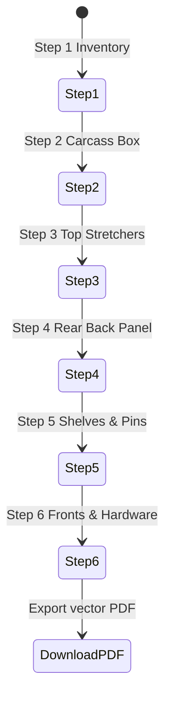

# Assembly Guide & Step-by-Step Manual

## Summary

The assembly view (`/assemble`) provides a workshop-ready, step-by-step construction guide for every placed cabinet. It pairs an interactive 3D exploded diagram with technical CAD orthogonal projections (Front, Rear, Section Cutaway), required tools and safety precautions, and an animated helper character. Users can step through the build process on mobile in the workshop or download a print-ready vector PDF manual.

---

## The simple case

A user selects cabinet `B30` and clicks **Assemble**. The interactive guide loads at **Step 1: Inspect Parts & Prepare Level Work Surface**. The 3D stage highlights the side panels and bottom deck in context. Clicking **Next Step** transitions to **Step 2: Assemble Carcass Deck & Side Panels**, animating the fasteners into position and highlighting the glue dados with a check-square safety reminder. At the final step, clicking **Download PDF Manual** saves a multi-page illustrated guide with part cut lists and callouts.

---

## The interaction, event by event

### 1. Starting
- **Trigger**: User navigates to `/assemble?cabinetId=cab-1` or calls WebMCP `get_assembly_guide`.
- **Initial capture**: Resolves `spec` and generates `BuiltCabinetModel` with 6 deterministic assembly steps.

### 2. Ending at once
- Step 1 opens immediately with complete part inventory, dimensions, required tools, and safety warnings.

### 3. Becoming extended
- Users navigate between steps using:
  - **Previous / Next Step** buttons
  - Left / Right keyboard arrow keys
  - Step Rail timeline navigation

### 4. While extended
- In the 3D Stage:
  - **Active parts**: Highlighted in electric blue with animated exploded displacement.
  - **Completed parts**: Rendered in full solid finish color.
  - **Future parts**: Ghosted with translucent opacity.
- In the CAD Projection View:
  - Renders technical vector-line orthogonal drawings with callout balloon markers.
- In the Guidance Panel:
  - Displays numbered instructions, safety cautions, and verified fastener counts.

### 5. Finishing
- Step 6 displays the complete finished cabinet with hardware attached.
- Clicking **Download PDF Manual** generates an offline-ready assembly handbook.

---

## Modifiers

| Modifier | Mode | Description |
| :--- | :--- | :--- |
| **Reduced Motion** | Preference | Snaps exploded part positions instantly without lerp animation |
| **Mobile Focus** | Viewport | Stacks rail, 3D stage, and guidance into single scrollable column |
| **Interactive Mode** | Stage Mode | Allows free rotation and manual part inspection during build |

---

## Cancel and interrupt

1. **Explicit abort**: Clicking `Back to Planner` returns to layout workspace.
2. **Switching mid-way**: Step index is preserved when switching between 3D stage and CAD sheet views.
3. **Clean completion**: PDF download runs synchronously in memory without network dependency.
4. **Environment failure**: Vector CAD diagrams render cleanly even when WebGL is unavailable.
5. **Page exit**: Safe to bookmark or reload on mobile devices.
6. **Target changes**: If the cabinet model is modified in planner, assembly regenerates with updated dimensions.
7. **Input channel change**: Supports full touch swipe gestures on tablets and phones.

---

## Interactions with other systems

1. **Permissions**: Read-only instructional workflow.
2. **History & undo**: Independent of layout undo stack.
3. **Containers & parents**: Respects resolved door style, hardware, drawer slides, and hinges from planner.
4. **Locked & read-only state**: Guidance reflects exact physical specifications.
5. **Offline behavior**: All CAD vector projection and PDF generation occur 100% client-side.
6. **Collaboration**: Fully readable via WebMCP `get_assembly_overview` and `get_assembly_guide`.
7. **Notifications**: Step completion status is emitted via screen reader announcements.
8. **Configuration & preferences**: Responsive layout adapts down to 320px mobile screens.

---

## Edge cases

- **Corner lazy Susan cabinets**: Step sequence assigns corner-specific carcass panels (`corner_panel_left`, `corner_panel_return`) to step 2 cleanly.
- **Cabinets without shelves**: Step 5 adjusts automatically to cavity inspection.

---

## Open questions and verification

- **Verified commit**: `204a4af` (`main` branch).
- **Automated test evidence**: `tests/browser/assembly-focus.spec.ts`, `tests/domain/part-builder.test.ts`.
