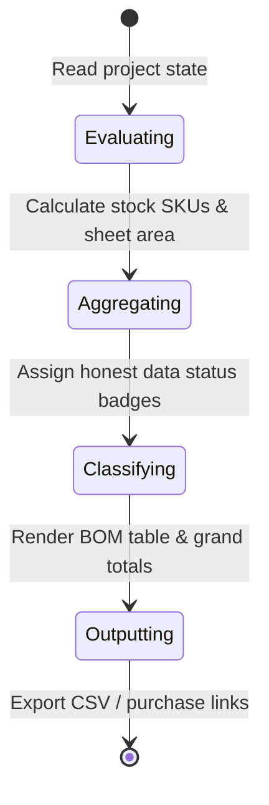

# Bill of Materials (BOM) & Honest Pricing

## Summary

The BOM view (`/bom`) transforms the active 3D room layout into an itemized, honest procurement list. It aggregates stock cabinet SKUs, custom 3/4" and 1/4" sheet goods, hardware pulls, fastener packs, shelf pins, continuous countertop square footage, toe kicks, and molding trim. Each row provides honest retailer data: verified Home Depot / Lowe's / IKEA SKUs, estimated search links, or explicit `material-estimate` labels for custom cabinetry.

---

## The simple case

A user navigates to the **BOM** tab from the top navigation bar. The calculation engine scans all placed cabinets, calculates total plywood sheet requirements with 10% shop waste, sums hardware pulls, and outputs a subtotal of $1,420 for stock cabinets alongside 4 sheets of 3/4" hardwood plywood. Clicking **Export CSV** downloads a structured spreadsheet ready for retailer ordering or contractor quoting.

---

## The interaction, event by event

### 1. Starting
- **Trigger**: User navigates to `/bom` or agent calls WebMCP `get_bom`.
- **Initial capture**: `computeProjectBOM` reads all `cabinets` and `builtInElements` from the active `RoomProject`.

### 2. Ending at once
- If the project is empty, the table renders a clear empty state: `Add a cabinet or built-in element to generate procurement rows.` with $0.00 grand total.

### 3. Becoming extended
- For projects with cabinets:
  - **Stock cabinets**: Grouped by definition code with quantity multipliers and retail pricing.
  - **Custom built cabinets**: Evaluates individual carcass panels, tops, bottoms, backs, and stretchers against standard 48" × 96" sheet limits, adding 10% cut waste.
  - **Hardware**: Sums door pulls, drawer pulls, shelf support pins (4 per shelf), and carcass assembly fastener packs.
  - **Built-in elements**: Computes countertop surface square footage and linear feet of continuous trim.

### 4. While extended
- Rows are categorized into clear sections: `Cabinets`, `Sheet Goods`, `Hardware`, `Countertops`, and `Trim`.
- Data status badges clearly indicate `Verified`, `Search-Only`, or `Material Estimate`.

### 5. Finishing
- Users can click retailer search links to open verified product listings or trigger a structured CSV/JSON download.

---

## Modifiers

| Modifier | Field | Description |
| :--- | :--- | :--- |
| **Waste Factor** | Sheet Goods | Applies configured waste percentage (10% standard) |
| **Pack Quantities** | Hardware | Rounds fasteners and shelf pins up to nearest full box |
| **Data Status** | BOM Row | Discloses whether pricing is verified, search estimate, or unpriced |

---

## Cancel and interrupt

1. **Explicit abort**: Navigating away from `/bom` returns to planner without loss of project state.
2. **Switching mid-way**: State recalculates automatically when returning after scene modifications.
3. **Clean completion**: Exporting CSV triggers native browser download dialog.
4. **Environment failure**: Network loss does not affect BOM calculations (all math is local).
5. **Page exit**: Safe to refresh at any time.
6. **Target changes**: Changes made in another tab or by an AI agent update the BOM upon rerender.
7. **Input channel change**: Fully operable via keyboard navigation and screen readers.

---

## Interactions with other systems

1. **Permissions**: Read-only reporting surface.
2. **History & undo**: BOM updates reactively whenever project history changes.
3. **Containers & parents**: Attached countertops and toe kicks aggregate with parent cabinet runs.
4. **Locked & read-only state**: Unpriced custom builds do not invent fake retail dollar values.
5. **Offline behavior**: Full pricing aggregation and CSV export operate 100% offline.
6. **Collaboration**: Accessible via WebMCP `get_bom` tool.
7. **Notifications**: Alerts if oversized parts exceed standard sheet dimensions.
8. **Configuration & preferences**: Honors decimal or fractional unit preferences.

---

## Edge cases

- **Oversized custom panels**: Flags panels exceeding 48" × 96" standard sheet boundaries with an explicit warning note.
- **Missing retail mapping**: Emits honest `Price unavailable` notice without breaking grand total calculations.

---

## Open questions and verification

- **Verified commit**: `204a4af` (`main` branch).
- **Automated test evidence**: `tests/domain/bom.test.ts`.
