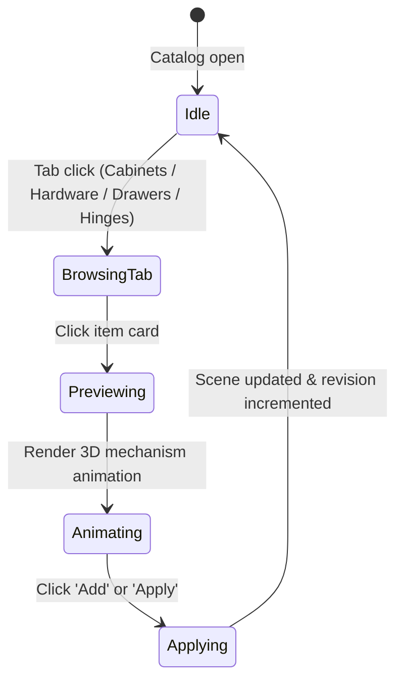

# Catalog, Hardware & Mechanism Previews

## Summary

The catalog sidebar provides an organized, 4-tab browsing and customization interface for cabinets, visible hardware, drawer systems, and concealed hinges. Each catalog entry renders an interactive 3D preview with real-time mechanism kinematic animations (e.g., drawer slide full extension cycle and concealed hinge 110°/165° pivoting). Users can search by keyword or category and apply hardware styles or mechanism upgrades directly to selected cabinets in the 3D scene.

---

## The simple case

A user clicks the **Hardware** tab in the catalog rail, filters by **Pulls**, and selects `3" Matte Black Cup Pull`. The 3D preview box at the top of the rail displays the metallic pull rotating under studio lighting. Clicking the **Add** button immediately attaches the selected pull package to the currently selected cabinet in the 3D scene, updating its BOM requirements and visual geometry simultaneously.

---

## The interaction, event by event

### 1. Starting
- **Trigger**: User selects one of the 4 catalog tabs: `Cabinets`, `Hardware`, `Drawers`, or `Hinges`.
- **Immediate visual change**: The active tab switches with a smooth sliding highlight. The catalog list updates with category-specific cards, and the top interactive 3D preview canvas renders the primary option.

### 2. Ending at once
- Clicking an item thumbnail or title selects it as the active preview candidate in the catalog rail without altering the 3D planner scene.

### 3. Becoming extended
- When viewing a Drawer Box System or Hinge:
  - The 3D preview canvas mounts a continuous kinematic animation loop.
  - Drawers smoothly extend outward along undermount runners over a 2.4-second cycle with realistic soft-close deceleration.
  - Hinges animate a 3D door slab pivoting open to the exact manufacturer opening angle (110°, 165°, 60°, 105°) with soft-close return.

### 4. While extended
- Users can manually rotate the 3D preview model with OrbitControls.
- Selecting a different mechanism card immediately updates the 3D preview without reloading the WebGL context.

### 5. Finishing
- Clicking **Add** on a cabinet card opens the staging placement bar on the active wall.
- Clicking **Apply** on a hardware, drawer, or hinge card executes `configureCabinet` on the primary selected entity, committing the choice to the revision history.

---

## Modifiers

| Modifier | State / Prop | Behavior at Start | Behavior During Interaction |
| :--- | :--- | :--- | :--- |
| **Category Filter** | Dropdown | Filters cabinet families (Base, Wall, Tall, Corner, etc.) | Updates visible list in real time |
| **Search Query** | Text input | Filters entries matching name, SKU, or keywords | Debounced search with 1px optical glyph alignment |
| **WebGL Support** | Hardware flag | Initializes 3D canvas synchronously | Falls back gracefully to high-contrast SVG thumbnails |

---

## Cancel and interrupt

1. **Explicit abort**: Clicking the `Close` button or pressing Escape closes the catalog drawer on mobile viewports.
2. **Switching mid-way**: Switching tabs mid-animation immediately stops the preview cycle and mounts the new category geometry.
3. **Clean completion events**: Committing a cabinet placement clears the placement bar and returns the catalog to idle.
4. **Environment failure**: If WebGL context is lost, the preview displays an accessible static thumbnail fallback.
5. **Page exit**: State restores cleanly on reload.
6. **Target changes**: Deselecting all cabinets disables the `Apply` button for mechanism upgrades.
7. **Input channel change**: Touch interactions support full drawer opening and closing on mobile viewports.

---

## Interactions with other systems

1. **Permissions**: Unrestricted browsing and selection.
2. **History & undo**: Applying a hardware/mechanism configuration records an undo snapshot.
3. **Containers & parents**: Hardware packages attach directly to doors and drawer fronts of parent cabinet instances.
4. **Locked & read-only state**: Incompatible mechanism options (e.g. bi-fold corner hinges on rectangular base cabinets) are disabled.
5. **Offline behavior**: Full catalog and 3D preview assets are bundled client-side.
6. **Collaboration**: Fully scriptable via WebMCP `list_catalog_options` and `configure_cabinet`.
7. **Notifications**: Emits aria-live announcements when filters update.
8. **Configuration & preferences**: Honors reduced motion by pausing continuous preview loops on request.

---

## Edge cases

- **Cabinets with zero drawers**: Applying a drawer box system is gracefully prevented or no-ops with an informative status message.
- **Open-shelf cabinets**: Hardware application is suppressed for open bookcases and filler trims.

---

## Open questions and verification

- **Verified commit**: `204a4af` (`main` branch).
- **Automated test evidence**: `tests/domain/catalog.test.ts`, `tests/browser/planner-cabinet-making.spec.ts`.
