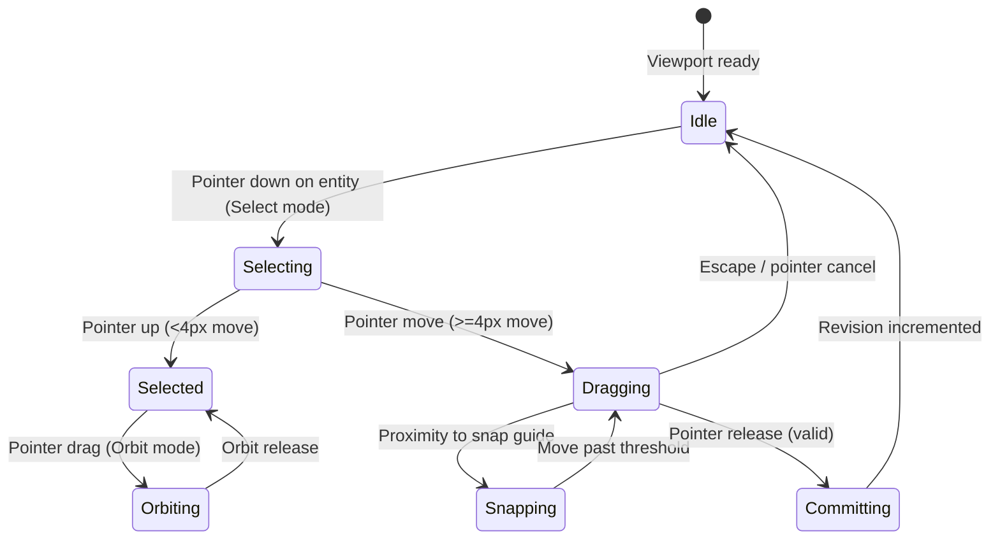

# Planner Workspace & 3D Interaction

## Summary

The planner workspace (`/planner`) is CabCraft 3D's primary authoring surface. It renders a real-time, interactive WebGL scene of the project's perimeter walls, doors, windows, appliances, placed stock/built cabinets, and continuous architectural elements (countertops, toe kicks, crown molding). Users navigate the space using a floating glassmorphic viewport tool dock, manipulate objects directly or via numeric steppers, and verify building clearances in real time against National Kitchen & Bath Association (NKBA) standards.

---

## The simple case

A user selects the **Select** tool from the floating dock, clicks a cabinet (e.g., `B30` 30" Base Cabinet) on the North wall, and drags it horizontally. As the pointer moves, the cabinet follows the wall plane and magnetically snaps to the corner wall boundary with a blue guideline. Releasing the mouse commits the 18" offset to the revision history. The user presses **`O`** to switch to Orbit mode, left-drags the canvas to inspect the end clearance, and taps **`F`** to smoothly focus the camera directly on the selected cabinet.

---

## The interaction, event by event

### 1. Starting
- **Trigger**: User clicks an entity with the Select tool, or clicks a navigation mode in the Viewport Tool Dock (`Select`, `Orbit`, `Pan`, `Zoom`, `Measure`).
- **Initial capture**: Pointer position, target entity ID, initial wall offset, and initial camera spherical coordinates are recorded in memory.
- **Immediate visual change**: The selected entity receives an electric cyan (`#38BDF8`) glowing wireframe bounding box, nominal 3D dimension badges (`30" W`, `34 1/2" H`), and the floating contextual micro-toolbar animates into view above the bottom center.

### 2. Ending at once
- If the mouse pointer is released within 4px of the initial press without dragging, the interaction completes immediately as a discrete selection event. No movement preview is created, and the project revision remains unchanged.

### 3. Becoming extended
- When pointer movement exceeds 4px while holding down on an entity:
  - The system transitions from click-selection into `drag-move` state.
  - A transient `ScenePreview` token is generated with `kind: 'move'`.
  - The primary entity and all co-selected items enter ghosted transform preview.

### 4. While extended
- Pointer coordinates project onto the active wall's 3D coplanar plane.
- The snap resolver evaluates alignment against adjacent cabinet side panels, wall ends, opening frames, and standard grid intervals.
- Active magnetic snap lines render in real time.
- If a clearance error occurs (e.g., collision with an appliance or wall boundary overflow), the placement status updates immediately to `Placement blocked`.

### 5. Finishing
- **Commit**: On pointer release (`onPointerUp`), `commitScenePreview` atomically validates the preview token against `expectedRevision`. If valid, the new wall offset and elevation are written to `RoomProject`, revision increments by 1, and a new undo snapshot is saved.
- **Cancel**: If cancelled via Escape or pointer capture loss, `cancelScenePreview` discards the ghost state and restores the original geometry.

---

## Modifiers

| Modifier | Mode / Key | Behavior at Start | Behavior During Interaction |
| :--- | :--- | :--- | :--- |
| **Shift** | Key down | Constrains movement to discrete 3-inch increments | Snaps drag preview to 3" multiples |
| **Alt** | Key down | Fine micro-stepping (1/16" precision) | Disables coarse magnetic snapping |
| **Ctrl / Cmd** | Key down | Multi-selection toggle | Adds/removes entity from `selectedEntityIds` |
| **V / S** | Shortcut | Activates Select & Move tool | Switches cursor to default/pointer |
| **O** | Shortcut | Activates 3D Orbit tool | Switches cursor to grab/grabbing |
| **P** | Shortcut | Activates 3D Pan tool | Switches cursor to all-scroll |
| **M** | Shortcut | Activates Measure tool | Switches cursor to crosshair |
| **F** | Shortcut | Focus selection | Glides camera smoothly to center selection |
| **Home / R** | Shortcut | Reset view | Smoothly returns camera to default 3D perspective |

---

## Cancel and interrupt

1. **Explicit abort**: Pressing Escape immediately cancels active drag moves, clears active measurement points, or deselects all entities.
2. **Switching mid-way**: Selecting another tool from the dock mid-drag immediately cancels the uncommitted preview.
3. **Clean completion events**: Triggering Undo (`Ctrl+Z`), Redo (`Ctrl+Y`), or a WebMCP tool call aborts active previews and applies the state transition cleanly.
4. **Environment failure**: WebGL context loss triggers the accessible fallback banner; semantic controls remain fully functional.
5. **Page / tab exit**: Page refresh restores the initial project state; uncommitted drafts in inspector fields are discarded.
6. **Target changes**: If a WebMCP agent modifies or removes a selected cabinet while the user inspects it, the inspector smoothly updates or closes without crashing.
7. **Input channel change**: Releasing pointer capture or switching between mouse and touch cancels active drag previews non-destructively.

---

## Interactions with other systems

1. **Permissions**: Single-user local workspace; full authoring permissions in all views.
2. **History & undo**: Every committed drag move, numeric stepper change, or alignment action records a snapshot in `historyPast` (capped at 50 revisions).
3. **Containers & parents**: Cabinets are child entities of their assigned `wallId`. Rotating a room or changing layout shape retains wall-local relative offsets.
4. **Locked & read-only state**: Stock cabinet exterior dimensions (`width`, `height`, `depth`) are locked; custom built-ins allow free parametric dimension editing.
5. **Offline behavior**: 100% client-side application; all geometry generation, snapping, and rendering operate entirely offline.
6. **Collaboration**: Agent interactions via WebMCP are serialized through the centralized project store revision counter.
7. **Notifications**: Transient operation feedback is emitted via aria-live status regions and visual badge callouts.
8. **Configuration & preferences**: Honors system `prefers-reduced-motion` by snapping camera transitions without lerp delays.

---

## Edge cases

- **Drag across corner walls**: Dragging an entity past the wall boundary restricts movement to the wall span; moving entities between walls requires selecting the target wall in the inspector or pressing **`Rotate 90°`**.
- **Accidental double-click**: Double-clicking an entity preserves its selection state without triggering duplicate move transactions.
- **Zero-length walls**: Prevented at domain level; walls enforce minimum length of 24 inches.

---

## Open questions and verification

- **Verified commit**: `204a4af` (`main` branch).
- **Automated test evidence**: `tests/browser/planner-cabinet-making.spec.ts`, `tests/browser/ui-improvements.spec.ts`.
- **Runtime verification**: Tested in Chrome 120+ with hardware acceleration.
